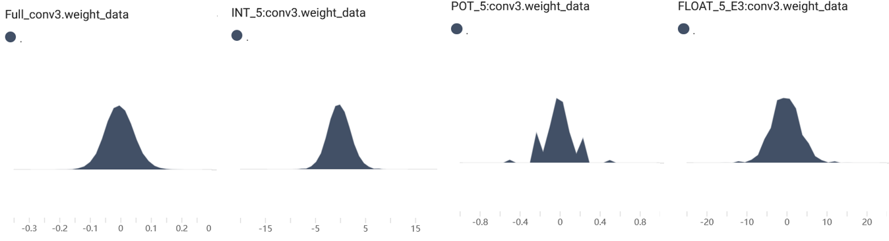
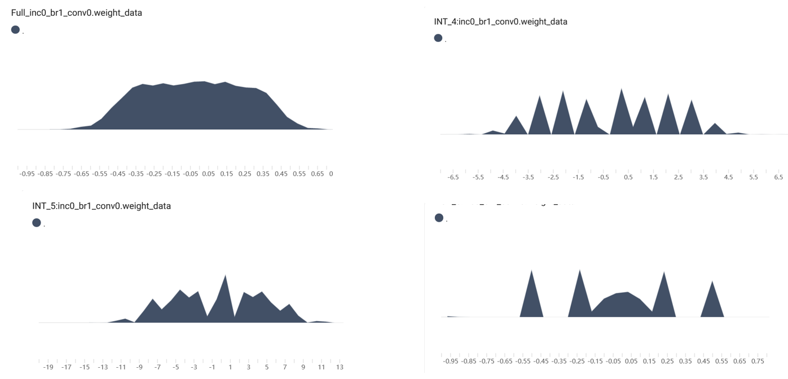

# 模型整合说明

+ 该文件夹下实现了基于cifar10数据集的AlexNet、AlexNet_BN、VGG_16、VGG_19、Inception_BN的整合。
+ 新增了ResNet_18、ResNet_50、ResNet_152、MobileNetV2的整合

### 部署说明

#### cfg_table

在该通用框架下，当前所有模型部署只需要提供一个cfg_table，如包含特殊结构（如Inception_BN的inception多分支结构），额外针对特殊结构提供cfg_table即可。详见`cfg.py`

cfg_table书写规则说明如下：

+ 每项根据进行量化的合并单位给出，例如Conv后接BN或BN+ReLU或BN+ReLU6时，将被统一合并为一个量化层，则在cfg_table中表现为一项，''/'B'/'BRL'/'BRS'参数可选。
+ 针对不涉及量化，但位置需特别指定的操作，如drop、view、softmax，同样在cfg_table中单独指定。

根据cfg_table，也相应简化了fold_ratio和fold_model方法，合并与量化层进行对比的全精度层的参数值、参数量、计算量。

#### 训练方案

+ 使用了新的学习率方案，概述如下：

  + 更大的batch_size(32->128)，可以更充分学习到数据分布，以期得到更好的泛化性能和量化效果
  + 更小的初始学习率、余弦退火策略学习率调度器`CosineAnnealingLR`（周期500epochs）：以获得更平缓的参数更新，并与更大的batch_size相适应
  + 数据增强：dataloader的transform由Resize更改为RandomCrop
  + 验证集：从训练集切分20%的样本作为验证集，防止测试集过拟合，也避免引入测试集噪声导致量化效果的偏差。
  + weight_decay：惩罚过大权重值，避免过拟合，同时一定程度增强量化效果。
  + “早停”：当连续patience个epoch未取得精度提升时，如果已经达到过最小精度，则早停，从而避免过拟合
  + “复活”：当未达到最小精度界限时，满足上述条件不停止，而是重载bestpoint。该方法最后未采用

+ 不同训练方式的全精度模型准确度和ptq拟合结果

  + SGD优化器（初始lr=0.005,end_lr_bound=0.00005）
  + SGD+momentum=0.9
  + SGD+momentum=0.95+weight_decay=1e-4+nesterov。最终采用
  + Adam优化器（初始lr=0.001,end_lr_bound=0.00001）

| Model        | S_acc | S_R2                   | S_m9_acc | S_m9_R2 | S_m95_acc | S_m95_R2 | A_acc | A_R2   |
| ------------ | ----- | ---------------------- | -------- | ------- | --------- | -------- | ----- | ------ |
| AlexNet      | 87.33 | 0.9535                 | 88.91    | 0.9202  | 87.15     | 0.9587   | 87.75 | 0.4999 |
| AlexNet_BN   | 88.17 | 0.9641                 | 90.15    | 0.9678  | 89.02     | 0.9508   | 89.86 | 0.8492 |
| VGG_16       | 89.03 | 0.8411                 | 92.14    | 0.7813  | 91.67     | 0.8929   | 92.75 | 0.7334 |
| VGG_19       | 88.67 | 0.8750                 | 92.27    | 0.7829  | 91.68     | 0.9155   | 92.26 | 0.6578 |
| Inception_BN | 88.55 | 0.9218                 | 92.78    | 0.9725  | 92.40     | 0.9776   | 93.77 | 0.9121 |
| ResNet_18    | 84.32 | 0.9493                 | 89.24    | 0.9699  | 87.72     | 0.9538   | 90.34 | 0.9585 |
| ResNet_50    | 82.10 | 0.9498                 | 89.85    | 0.9693  | 89.52     | 0.9692   | 91.61 | 0.9594 |
| ResNet_152   | 79.76 | 0.8947                 | 89.35    | 0.7978  | 88.92     | 0.8519   | 91.78 | 0.9083 |
| MobileNetV2  | 84.61 | 0.9918（no tolerance） | 88.98    | 0.9632  | 88.93     | 0.9882   | 91.93 | 0.8082 |
| ALL          | n     | 0.8014                 | n        | 0.6787  | n         | 0.7189   | n     | 0.6726 |

+ 结果展示：

  + sgd-AlexNet

    

  + sgd+momentum95+...-AlexNet

    

  + adam-AlexNet

    

  + 最终采用SGD+momentum=0.95+weight_decay=1e-4+nesterov

    以下为cifar10上拟合效果，均直接使用js_flops，未进行加权处理

    + 未分段

    

    + 分段（3.5为分界）

      

  + SGD和Adam差别原因分析：

    1. Adam优化器采用动态调整的学习率,通常会使模型更新的权重参数具有较大的变化范围。而SGD使用固定学习率,参数更新幅度较小。这会导致Adam优化器训练出的模型参数分布更加集中,而SGD训练出的模型参数分布更加分散,有利于量化。

    2. Adam优化器在反向传播时会对梯度进行额外的平滑和校正,缓解梯度消失与爆炸问题；在参数更新时,会考虑一阶矩和二阶矩的影响,实现比较平稳的更新。而SGD直接使用原始梯度。这也会导致Adam优化器训练出的模型参数更加集中,不利于量化。

    3. Adam优化器对小的梯度更加敏感,可以更快找到较优解。但对模型量化不利。SGD相对而言更新步骤更大,有利于量化。

    所以,总体来说,Adam优化器采用的平滑逐步的梯度更新策略,会得到参数分布更加集中的模型。这种模型不利于进行有损压缩的量化。而SGD的比较激进的更新方式,会得到参数分布更加分散的模型,更加适合量化。

+ 如果想加快训练速度，可以缩减周期训练epoch数，并增加dataloader的num_worker以缩短数据加载实现。（num_workder的并行加载有概率出现访问共享内存错误。不进行手动指定随机种子，则每个num_worker会自动分配不同的随机种子，可以一定程度避免这个错误）

### PTQ部分概述

#### matlab脚本

+ `flops\param`、`flops\param_all`、`flops_all_weight`分别是对单个模型、全体模型、计算量加权后全体模型的拟合。
  针对单个模型，脚本使用不同颜色标记不同量化类别的点；针对全体模型，脚本使用不同颜色标记不同模型的点。
+ 脚本内添加了拟合条件限制，以保证拟合曲线一定是单调不降的。如果想允许拟合曲线在某个位置出现略微的转折下降，可以改动tolerance为一个较小的负数，如-1e-5。
+ 拟合条件限制基于采样实现，对于fakefreeze，采样步长设为0.1，对于L2方法，采样步长设为10
+ 脚本同时在图像上输出拟合效果评估，如SSE、R方、RMSE指标。
+ 支持选择拟合模型，当前可选择poly为2/3/4分别表示rational模型分子分母的多项式次数
+ 由于每次拟合结果会具有细微差别，后续可以更改脚本，使得脚本在每次拟合完成后再进行三次符合约束的拟合，效果均不好于当前拟合才终止，否则取效果更好的拟合结果，并重复该过程。该步骤目前由人工完成
+ 新增flops_sep，对poly2提供了分段拟合。

#### 拟合方式及结果简述

+ 使用fakefreeze方法对量化层参数rescale到和全精度层一致。
+ 将weight：bias的js散度权重比设置为1：1，即有bias的层，weight影响不变，bias额外施加影响。
+ 对模型计算量进行log10和cuberoot加权

#### 拟合中发现的问题

在VGG_16 VGG_19 Inception_BN的fakefreeze方式中，都观察到POT量化点扎堆（acc_loss具有略小差距，js_div相近，在图上表现为连续的一竖列点），影响了量化效果。

观察这些模型的权重参数分布，可以发现出现问题的模型存在着无尖端的权重分布。而有尖无尖的分布在面对不同量化方式的分布如下：

根据不同模型权重分布的特点，可以推测出现问题的模型POT量化散度较大且集中的重要原因是量化后分布与原分布趋势不同。基于此，我们可能需要在相似度之外额外的考虑模型参数分布与量化方式的适配性。这需要进行实验的验证，例如，直接度量全精度模型-量化模型用于衡量分布趋势的系数；度量全精度权重的尖锐程度和量化表的尖锐程度等。并将所得值作用于原先所求js散度上。

+ 方案一：度量全精度模型、量化模型分布趋势相似度

  使用pearson相关系数或余弦相似度，并作用于js散度。例如，若POT量化的余弦相似度较小（趋势差异较大），考虑将js散度乘余弦相似度，从而矫正因趋势过大的散度。

+ 方案二：考虑尖锐程度

  考虑到无尖端分布遇到有极大尖端的POT量化点列表会产生不同趋势的问题，从分布和量化点的角度入手。例如，衡量在均值范围内的比例，差异较大可能说明尖锐程度差异大，从而矫正js散度。或者可以考虑对原分布做bins切割，若某个bins有量化点则统计该bins内元素，考虑所有和量化点在同一bins的点数以衡量分布与量化方式的适配度。

#### 后续增强拟合效果的方案

+ 针对POT量化点扎堆，可以考虑使用更关注趋势的Pearson相关系数、余弦相似度等对js散度进行修正，或者考虑将量化范围切分多个bins评估量化点覆盖率的方式修正。

+ 对weight和bias采取更合理的加权方式

  + 根据对精度的影响（不易衡量，不易确定基准）

+ 在模型整合上，尝试更有效的加权方式

+ 考虑到js散度达到一定值后acc_loss不会再上升（因为最差效果是随机分类，准确度也有10%），采取分段拟合的方式。

  

