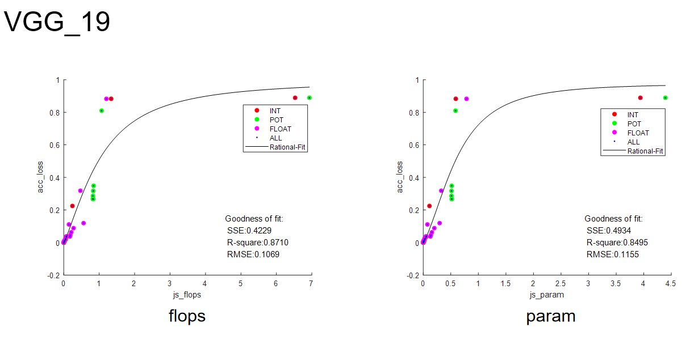
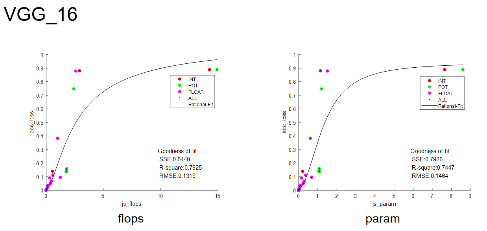

# fit_bkp

+ 备份之前的数据拟合分析结果

## update：2023/04/26

#### 拟合方式及结果简述

+ 分别使用了fakefreeze方法和取L2范数的方法将量化层分布rescale到和全精度层一致

  + L2范数在针对平面结构的单个模型的拟合上能取得更好的效果
  + fakefreeze在对非平面结构模型（Inception_BN）和所有模型整合上取得较好效果
  + 为了对多模型的普适性，综合考虑下选择fakefreeze方法

+ 在对fakefreeze方法的flops模型整合分布观察可以发现，计算量较大的模型在较小js散度时就达到了较大的精度损失，因此同时将模型计算量考虑对散度加权。

  具体而言，分别将LOG10(Mac)和Mac^(1/3)作为散度系数，拟合效果均取得了一定提升。

  PS:对param使用相同方法拟合效果反而变差，需要后续实验。对L2方法采用了乘sqrt(Mac)方案，拟合效果也有一定提高。

#### 基于fakefreeze方法的其他尝试

+ 根据weight和bias参数比

  已初步试验，模型整合加权前后flops拟合效果R方分别为0.78和0.81。可能是由于weight和bias的参数比过于接近1，导致bias的js散度损失被忽略。

+ 将weight和bias从0.5:0.5变为1:1，即有bias的层将增大影响。

  经过试验，取得了比原方案更好的拟合效果，将单个模型拟合结果和模型整合拟合结果罗列于下。

#### 拟合中发现的问题

在VGG_16 VGG_19 Inception_BN的fakefreeze方式中，都观察到POT量化点扎堆（acc_loss具有略小差距，js_div相近，在图上表现为连续的一竖列点），影响了量化效果。

观察这些模型的权重参数分布，可以发现出现问题的模型存在着无尖端的权重分布。而有尖无尖的分布在面对不同量化方式的分布如下：

根据不同模型权重分布的特点，可以推测出现问题的模型POT量化散度较大且集中的重要原因是量化后分布与原分布趋势不同。基于此，我们可能需要在相似度之外额外的考虑模型参数分布与量化方式的适配性。这需要进行实验的验证，例如，直接度量全精度模型-量化模型用于衡量分布趋势的系数；度量全精度权重的尖锐程度和量化表的尖锐程度等。并将所得值作用于原先所求js散度上。

+ 方案一：度量全精度模型、量化模型分布趋势相似度

  使用pearson相关系数或余弦相似度，并作用于js散度。例如，若POT量化的余弦相似度较小（趋势差异较大），考虑将js散度乘余弦相似度，从而矫正因趋势过大的散度。

+ 方案二：考虑尖锐程度

  考虑到无尖端分布遇到有极大尖端的POT量化点列表会产生不同趋势的问题，从分布和量化点的角度入手。例如，衡量在均值范围内的比例，差异较大可能说明尖锐程度差异大，从而矫正js散度。或者可以考虑对原分布做bins切割，若某个bins有量化点则统计该bins内元素，考虑所有和量化点在同一bins的点数以衡量分布与量化方式的适配度。

#### 后续增强拟合效果的方案

+ 针对POT量化点扎堆，可以考虑使用更关注趋势的Pearson相关系数、余弦相似度等对js散度进行修正，或者考虑将量化范围切分多个bins评估量化点覆盖率的方式修正。

+ 对weight和bias采取更合理的加权方式

  + 根据对精度的影响（不易衡量，不易确定基准）

+ 在模型整合上，尝试更有效的加权方式

+ 考虑到js散度达到一定值后acc_loss不会再上升（因为最差效果是随机分类，准确度也有10%），采取分段拟合的方式。

  

## ptq拟合结果图示

+ 数据拟合

  + L2：使用L2范数将量化层参数rescale

  + fakefreeze：使用dequantize_tensor将量化层参数rescale

  + fakefreeze-nodiv：weight和bias不再是0.5:0.5而是1:1

  + fakefreeze-weightratio：weight和bias按照参数比加权，该参数比通常接近于1

    

### L2

+ 所有模型拟合

  

  

  

+ 单个模型拟合

  

  

  

  

  

### fakefreeze

+ 所有模型拟合

  

  

  

  

+ 单个模型拟合

  

  

  

  

  

  

#### fakefreeze_nodiv

+ 所有模型拟合

  

  

  

  

+ 单个模型拟合

  

  

  

  

  

