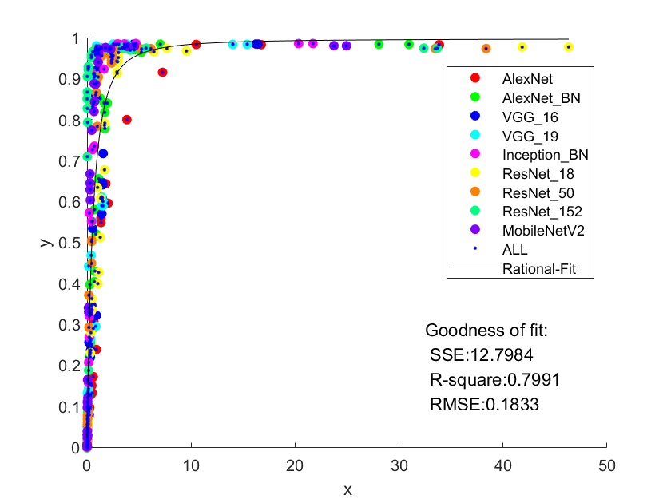

# ALL-cifar100量化

+ cfg最后输出层类别由cifar10的10改为100
+ 从训练集切分验证集

+ 训练器：Adam lr=0.0001
+ 全精度准确度

| AlexNet | AlexNet_BN | VGG_16 | VGG_19 | Inception_BN | ResNet_18 | ResNet_50 | ResNet_152 | MobileNetV2 |
| ------- | ---------- | ------ | ------ | ------------ | --------- | --------- | ---------- | ----------- |
| 56.88   | 61.60      | 63.29  | 60.84  | 68.44        | 43.26     | 37.1      | 38.56      | 50.3        |

+ 拟合结果：R2=0.7989

  