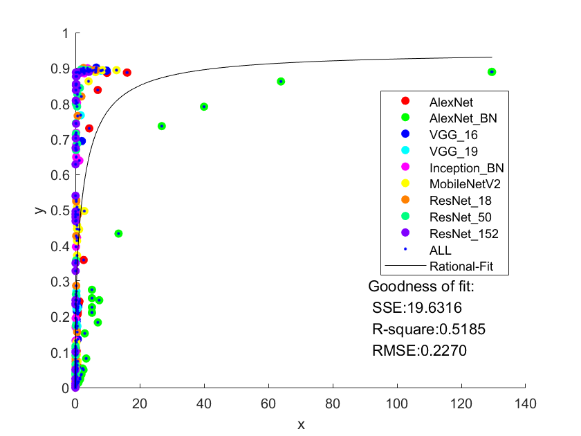
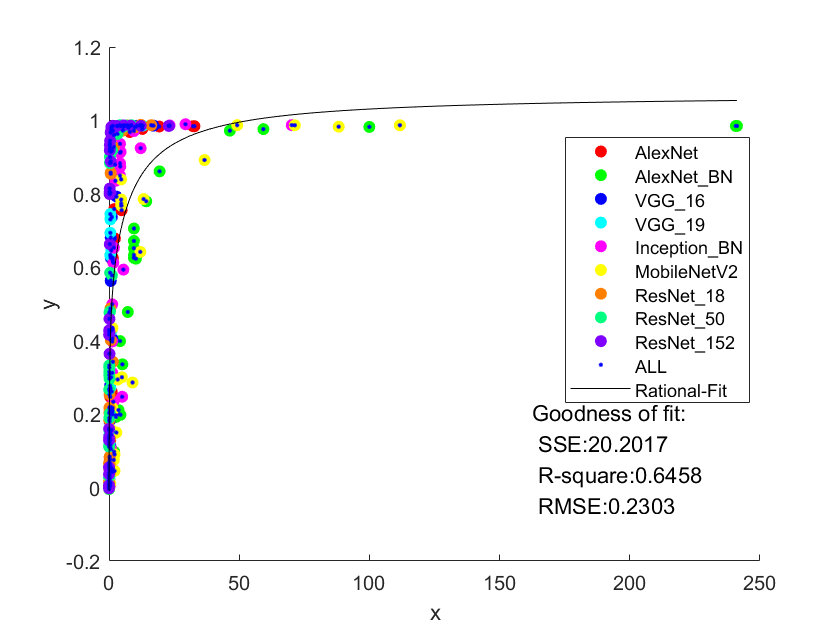
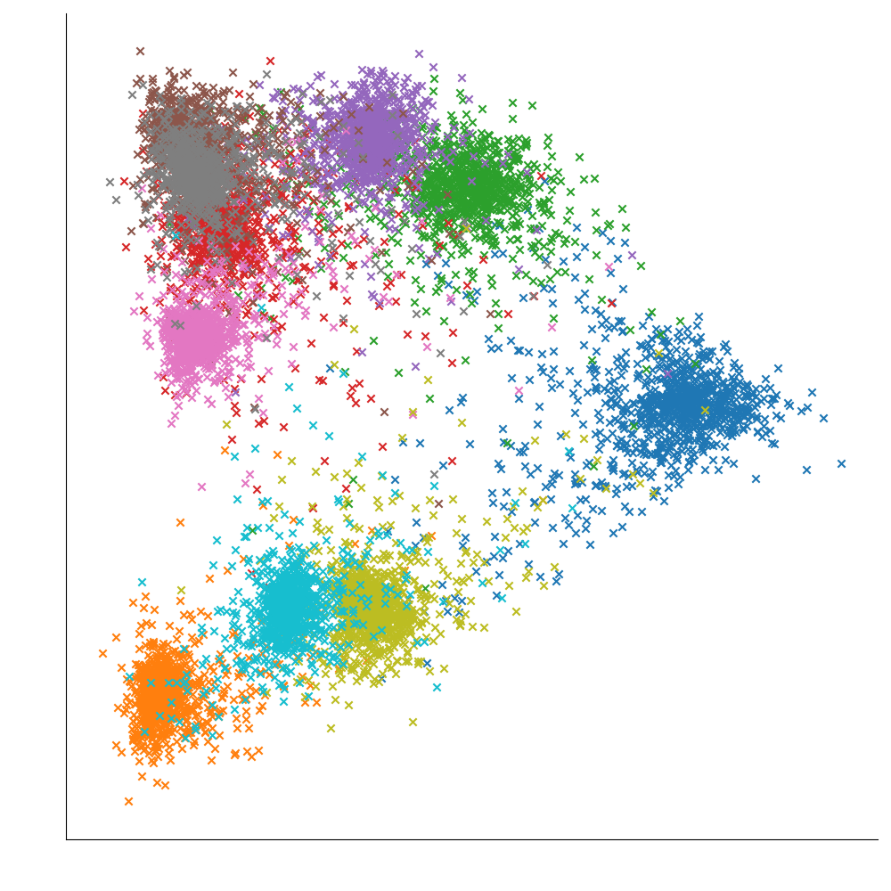
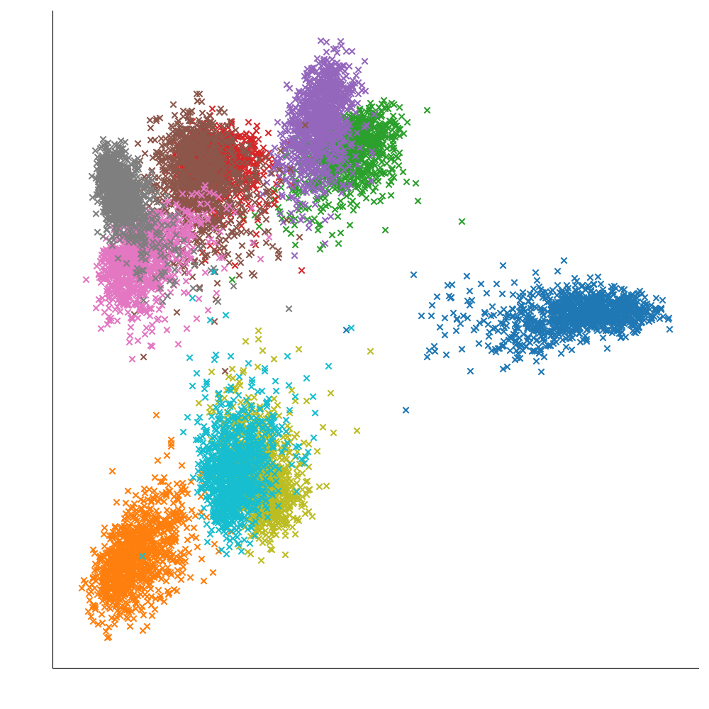
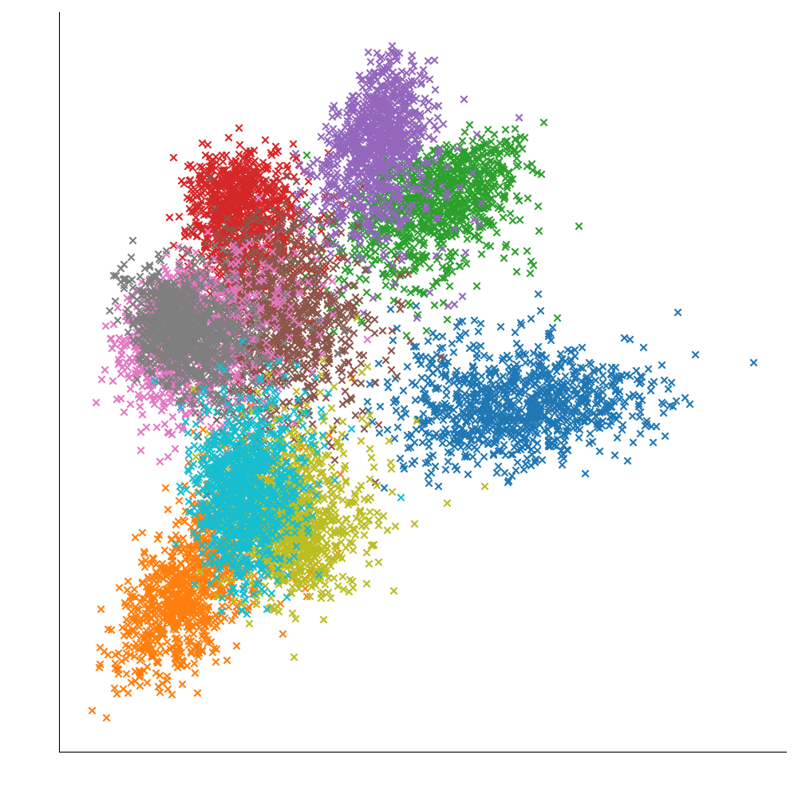
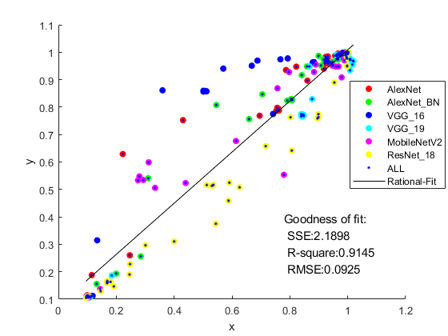
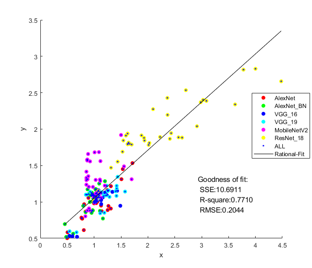
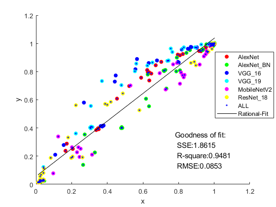
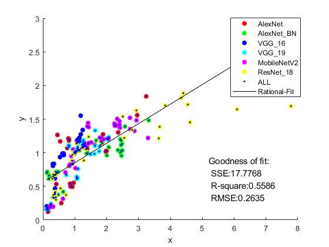

# ALL

+ 逐步将不含LSTM的模型全部功能加入该文件夹，包括对不同数据集支持、模型训练及量化、生成器训练和鲁棒性评估。

+ 之前ResNet系列和MobileNetV2模型结构有误，在cfg.py中进行了调整。

+ 全精度模型训练策略

  + SGD优化器 lr=0.1 weight_decay=0.9 nesterov=True momentum=0.9
  + MultiStepLR：epochs=200 milestones=[60,120,160] gamma=0.2。（epoch计数达到milestones时，lr乘gamma）
  + WarmUpLR：对第一个epoch，执行warmup，逐batch增大lr。

+ 生成器训练策略

  + Adam优化器 lr=0.001 b1=0.5 b2=0.999
  + MultiStepLR: epochs=20 milesontes = [15] gamma=0.1

+ 支持的数据集：cifar10/cifar100    待添加：imagenet

+ 功能列表及索引：

  [TOC]

## 训练全精度模型

+ slurm命令

  ```shell
  python train_one.py $Model $Dataset
  ```

  在ALL目录下运行脚本

  ```shell
  # 切换数据集需将脚本名字中{cifar10}改为{cifar100}
  # 训练单个模型
  sh scripts/train_one_cifar10.sh AlexNet/...
  # 训练全部模型
  sh scripts/train_all_cifar10.sh
  ```

+ 全精度Acc

​	**cifar10数据集**

| AlexNet | AlexNet_BN | VGG_16 | VGG_19 | Inception_BN | MobileNetV2 | ResNet_18 | ResNet_50 | ResNet_152 |
| ------- | ---------- | ------ | ------ | ------------ | ----------- | --------- | --------- | ---------- |
| 88.63   | 90.14      | 93.14  | 93.03  | 94.83        | 90.28       | 94.30     | 94.58     | 94.43      |

​	**cifar100数据集**

| AlexNet | AlexNet_BN | VGG_16 | VGG_19 | Inception_BN | MobileNetV2 | ResNet_18 | ResNet_50 | ResNet_152 |
| ------- | ---------- | ------ | ------ | ------------ | ----------- | --------- | --------- | ---------- |
| 63.43   | 66.31      | 71.12  | 70.45  | 77.97        | 66.76       | 75.73     | 77.22     | 77.41      |


## 模型量化及迁移准确性评估

+ 实验目标：无模型计算条件下预测迁移模型的分类精度损失

+ 实验背景：

  根据**Fixed-Point Back-Propagation Training（CVPR 2020）**观察，迁移前后模型参数的数据分布的相似度越低，准确性损失越高

+ 实验思路：

  1. 根据统一的模型部署和量化框架，部署模型并使用不同的量化方式（INT、POT、FLOAT）和位宽获取量化模型。
  2. 获取迁移前模型（全精度）和迁移后模型（量化）的各层参数相似度（js-div），并根据该层参数量/计算量占比加权求和，得到模型相似度js_param/js_flops
  3. 获取迁移前后模型在测试集上的精确度，并得到精度损失acc_loss = （全精度acc - 量化acc）  / 全精度acc
  4. 将各模型、各量化方式下的迁移前后模型进行js_flops - acc_loss拟合，得到泛化曲线

+ 新模型迁移准确性预测方式：

  1. 提供新模型结构，部署训练得到全精度模型
  2. 根据量化框架迁移得到量化模型
  3. 计算迁移前后模型的相似度，代入拟合曲线，即可预测迁移模型的精度损失

### 参数量和计算量统计

+ slurm命令

  ```shell
  python get_param_flops.py $name $Dataset > param_flops/$Dataset/$name.txt
  ```

  在ALL目录下运行脚本

  ```shell
  # 切换数据集需将脚本名字中{cifar10}改为{cifar100}
  sh scripts/ptflops_cifar10.sh
  ```

+ 结果见param_flops/{$Dataset}

### 量化、相似度、准确度获取

+ slurm命令

  ```shell
  python ptq_one.py $Model $Dataset
  ```

  在ALL目录下运行脚本

  ```shell
  # 切换数据集需将脚本名字中{cifar10}改为{cifar100}
  # 量化及评估单个模型
  sh scripts/ptq_one_cifar10.sh AlexNet/...
  # 量化及评估全部模型
  sh scripts/ptq_all_cifar10.sh
  ```

+ 拟合结果

  js_flops：量化模型和全精度模型各层参数的js散度按照计算量加权求和，表示模型间参数相似度

  acc_loss：（全精度acc-量化acc） / 全精度acc

​	**cifar10数据集**



​		单个模型及js_flops - acc_loss拟合对应R2：

| AlexNet | AlexNet_BN | VGG_16 | VGG_19 | Inception_BN | MobileNetV2 | ResNet_18 | ResNet_50 | ResNet_152 |
| ------- | ---------- | ------ | ------ | ------------ | ----------- | --------- | --------- | ---------- |
| 0.9819  | 0.9878     | 0.9727 | 0.9648 | 0.8693       | 0.9652      | 0.9181    | 0.9011    | 0.8994     |

> 考虑到单个模型拟合均较好，而整体拟合较差，后期将尝试加权处理。

​		

​	**cifar100数据集**



​		单个模型及js_flops - acc_loss拟合对应R2：

| AlexNet | AlexNet_BN | VGG_16 | VGG_19 | Inception_BN | MobileNetV2 | ResNet_18 | ResNet_50 | ResNet_152 |
| ------- | ---------- | ------ | ------ | ------------ | ----------- | --------- | --------- | ---------- |
| 0.9790  | 0.9730     | 0.9222 | 0.9115 | 0.8806       | 0.9570      | 0.8498    | 0.8620    | 0.8713     |

​		考虑到单个模型拟合均较好，而整体拟合尚有优化空间，后期将尝试加权处理。


## 模型迁移鲁棒性评估

+ 实验目标：无数据支持情形下预测模型的对抗攻击鲁棒性

+ 相关工作：

  1. **DaST: Data-free Substitute Training for Adversarial Attacks (CVPR 2020)** 提出通过生成器和替身模型对抗训练，从而在不知道模型具体结构和真实数据集的基础上进行模型窃取，利用替身模型生成对抗样本，从而攻击原模型，提高对抗攻击率。
     我们的实验目的不在于提高攻击率，而是提供鲁棒性评测的手段，同时已经知道了模型的结构，无需额外训练替身模型。因此重点在于训练生成器得到用于评测的伪数据集。相比论文中生成器通过生成大量伪样本，在更大规模替身模型上模拟原模型，我们的生成器需要生成高质量的样本用于评测。

  2. **Rob-GAN: Generator, Discriminator, and Adversarial Attacker (CVPR 2019)** 提出了联合训练生成器、判别器和对抗攻击者的方案。论文综合应用了生成器的伪样本和基于真实数据集的对抗样本对分类器进行训练，提出了基于分类器的伪样本能够更好提供图像分布信息，归纳到不可见数据；对真实样本对抗处理可以更好的限制判别器曲率，提高判别器鲁棒性。

     我们的实验在不使用真实数据集、训练生成器所得伪数据集而非判别器模型的前提下对上述思路进行了延续和强化。由于模型结构可见，生成器结合模型BN层统计、分类层权重等，更好的提取了原训练数据集的数据分布信息；对生成器伪样本进行一定训练使其能够较好的拟合分类结果后，对伪样本的对抗扰动，反向更新生成器，使所得伪数据集可以对模型取得更好鲁棒性。

  3. **Qimera: Data-free Quantization with Synthetic Boundary Supporting Samples (NeurIPS 2021)** 提出了过往研究中生成器存在的缺陷：所得伪样本的聚类小于真实数据集聚类，无法反应类间特征空间的输入情形，无法有效提升模型在分类边界的量化性能。基于该问题，论文提出了结合模型BN层统计、分类层权重以更好的提取分布信息，并添加类间样本（多个label）以提升生成器泛化性，更好的模拟原数据集信息。

     我们的生成器在该论文的代码基础上进行了拓展。由于该论文生成器所得伪数据集主要用于提升量化模型准确度，并未考虑对抗性情形，所得数据集在对抗性攻击下与原数据集表现差距较大。我们的代码在延续其根据模型信息提取数据分布、添加类间样本提高泛化性能基础上，对伪样本进行对抗扰动，提升了所得伪数据集的对抗性。

+ 实验思路：

  1. 结合提取的模型最后分类层权重设置生成器
  2. 训练生成器，使得生成样本能被模型正确分类至输入的随机标签，且分布符合模型BN层分布
  3. 调整生成器，根据模型在原测试集（或数据集外样本）上的表现（只需知道最终对抗下精度，无需知道数据内容），调整生成器所得伪数据集质量
     + 添加类间样本（多label）可以提升数据集泛化性，填充聚类之间的距离（降低模型在伪数据集上对抗精度）
     + 添加对抗样本可以提升伪数据集鲁棒性（增加模型唉伪数据集上对抗精度）
  4. 基于伪数据集评估全精度模型和量化模型的对抗精度，预测其鲁棒性

+ 额外的思路：（待测试）利用量化模型层中统计的每层in和out，将各层扰动前后的输出差/输入差相乘可得到模型lipschitz，得到理论上的鲁棒性上界。

+ 新模型迁移前后鲁棒性预测方式：

  1. 得到全精度模型和量化模型（同准确性部分）
  2. 训练生成器，并根据全精度模型在原测试集（或数据集外样本）上的评分进行调整
  3. 根据生成器所得伪数据集评估迁移前后模型的对抗精度，表示其鲁棒性

+ 实验价值：

  1. 提供了在不使用真实数据的前提下，基于生成器评估模型迁移鲁棒性的方法
  2. 提供了在已知模型结构及其在某数据集上表现情形下，训练/调整生成器以构建伪数据集的方法
  3. （待确定）所得伪数据集可以更好的归纳到测试集不包含的数据分布细节，更好反映理论上的模型鲁棒性

+ **对模型迁移其余部分的启示**：

  在本实验准确性部分，采用的是从头训练一个全精度模型的方法，因此知道全部的数据集和模型细节，同时基于训练集在各层的统计得到了量化模型，因此一个简单直观的鲁棒性评估方法是直接在测试集上观察量化模型的对抗下精度。

  考虑到更普遍的模型迁移场景，应该是给定预训练好的全精度模型，不需给定其训练所用的数据集即可直接预测其迁移后的准确性和安全性。对于量化、准确性、安全性均可在生成器的伪数据基础上稍加修改完成：

  1. 根据预训练模型提取cfg用于后续指导模型迁移

  2. 需要根据cfg更改模型结构为实验所设，并导入预训练模型的参数，得到全精度网络
  3. 根据鲁棒性部分实验思路，可以训练得到生成器，得到伪数据集

  4. 根据伪数据集的前向传播获取各层统计，得到量化网络
  5. 根据全精度网络和量化网络参数相似度预测迁移精度损失（同准确性部分）
  6. 根据全精度网络和量化网络在伪数据集上表现预测安全性。

### 生成器训练

+ slurm命令

  ```shell
  # 仅训练
  python gen_one.py --model $Model --dataset $Dataset --multi_label_num $Label
  # 训练后根据模型在测试集上对抗性得分进行调整
  python gen_one.py --model $Model --dataset $Dataset --multi_label_num $Label --adjust
  ```

  在ALL目录下运行脚本

  ```shell
  # 切换数据集需将脚本名字中{cifar10}改为{cifar100}
  #针对单个模型训练和调整生成器
  sh scripts/gen_one_cifar10.sh AlexNet/...
  #针对全部模型训练和调整生成器
  sh scripts/gen_all_cifar10.sh
  ```

+ 生成器训练及调整结果详见gen_result/{Dataset}/{Model}.txt

  + 训练时以输入生成器的label为基准，关注生成器生成的伪数据经过模型分类的结果与label的符合程度
  + 调整时以全精度模型在测试集上的精度和对抗下精度为指导，通过添加类间样本和对抗样本调整伪数据集的鲁棒性和泛化性

### 数据分布可视化

> 以cifar10数据集下的ResNet_18模型为例，可视化原测试集/仅训练的伪数据集/调整后的伪数据集的数据分布可视图

分别以测试集/伪数据集的data经过模型提取特征，根据PCA降维获取分布。label决定了样本分类颜色。

<table>
	<tr>
		<td><center></im</center></td>
        <td><center></im</center></td>
		<td><center></im</center></td>
    </tr>
</table>

+ 测试集的数据分布较为集聚，部分类间距离较大，无法覆盖整个输入特征空间
+ 仅训练的生成器所得伪数据较好的模拟了测试集的数据分布，但是进一步增大了类间距离，忽略了聚类边缘的样本。样本虽然分类精度高，但鲁棒性较差。
+ 通过调整，生长器的伪数据能保持较高的分类精度（高于测试集）和鲁棒性（对抗下精度与测试集误差不超过1%），且能够较好的覆盖特征空间，其评测结果对于一般输入样本更具泛化性

### 对抗攻击可视化

+ 展示对抗攻击下图片扰动结果，本实验采取的攻击强度均为人眼不可识别
+ 展示了测试集样本扰动前后的图像（下载后经过修改尺寸）

<table>
	<tr>
		<td><center></im</center></td>
        <td><center></im</center></td>
    </tr>
</table>

### 模型鲁棒性评估

+ slurm命令

  ```shell
  python robust_one.py --model $Model --dataset $Dataset --multi_label_num $Label $Adjust
  ```

  在ALL目录下运行脚本

  ```shell
  # 切换数据集需将脚本名字中{cifar10}改为{cifar100}
  # $Adjust置为“--adjust”表示评估调整后的生成器，空则为无调整生成器
  #针对单个模型评估鲁棒性
  sh scripts/robust_one_cifar10.sh AlexNet/...
  #针对全部模型评估鲁棒性
  sh scripts/robust_all_cifar10.sh
  ```

+ 鲁棒性评估结果详见robust_result/{Dataset}/{Model}{Adjust}.txt

+ 优势：

  + 从结果而言，从针对全精度模型生成的伪数据集上攻击结果预测真实测试集上攻击结果，指标更直观；
  + 从过程而言，针对全精度生成的伪数据集可以隐式表明模型特征，省略显式拟合的复杂
    + 生成器的解映射使用了模型最后全连接层的权重
    + 训练过程loss考虑了模型分类结果和BN层分布信息

+ 生成器调整技巧：

  + 训练过程中如果使用类内无对抗样本，伪数据集虽然分类精度高（接近100），但对抗下欠鲁棒
  + 调整阶段
    + 添加类间样本（多label）可以增强伪数据集泛化性，更好的覆盖特征空间空白部分
    + 添加类内对抗样本（类内样本加对抗扰动）可以增强伪数据集鲁棒性，使在保持一定无对抗分类精度（高于测试集）的同时取得更高的对抗下精度

+ 拟合结果：

  左图：无对抗下伪数据集相对精度 - 测试集相对精度

  右图：pgd对抗下伪数据集相对精度 - 测试集相对精度

  **cifar10**

  <table>
  	<tr>
  		<td><center></im</center></td>
          <td><center></im</center></td>
      </tr>
  </table>

  **cifar100**

  <table>
  	<tr>
  		<td><center></im</center></td>
          <td><center></im</center></td>
      </tr>
  </table>

  + cifar10和cifar100数据集下都能很好的反映无对抗情境下的分类精度
  + 添加对抗后，cifar10拟合效果尚可，而cifar100效果较差
  + 考虑到采用的对抗攻击是将样本错误分类而不需指定错误分类类别，cifar100更容易达成攻击，因此直接使用评分指导可能存在误差

+ 优化尝试方向：

  考虑成比例的添加对抗样本和类间样本，并使用相对精度以排除绝对值影响，希望提高拟合效果并完全排除原数据集（当前需要给出模型在测试集上有无对抗时的精度作为adjust的指导）


