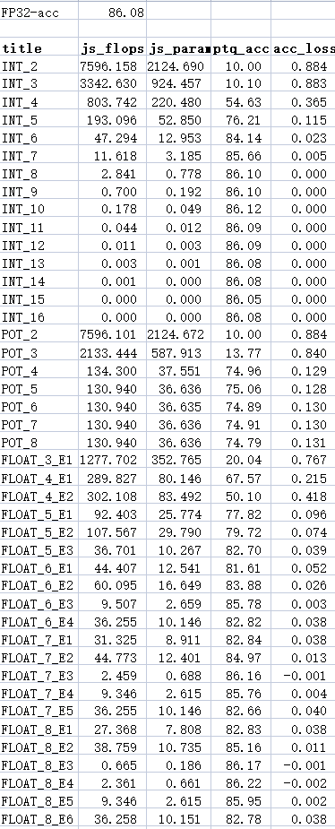
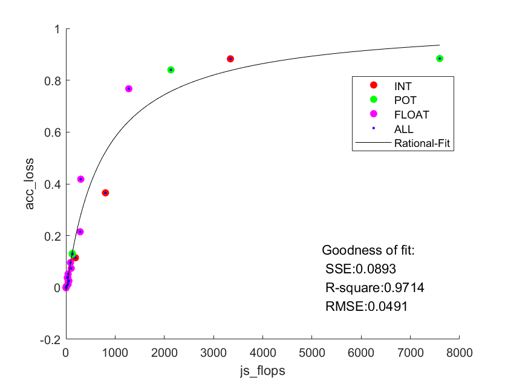

# AlexNet 量化说明

## ptq部分

+ INT/POT/FLOAT量化都采用相同的框架，可以通过`quant_type`进行确定

+ 量化范围：均采用有符号对称量化，且将zeropoint定为0

+ 量化策略：在第一次forward执行伪量化，统计每层的x和weight范围；后续interface在卷积/池化层中使用量化后的值进行运算。量化均通过放缩至对应范围后从量化点列表取最近点进行实现。

+ bias说明：每种量化模式下，bias采用相同的量化策略(INT:32bit量化，POT:8bit量化，FP8:FP16-E7量化)。bias量化损失对结果影响小，该量化策略也对运算硬件实现影响不大，但是在代码实现上可以更加高效，故采用。（英伟达的量化策略甚至直接舍弃了bias）  

  + 关于量化策略设置，可以更改`module.py`中的`bias_qmax`函数和`utils.py`中的`build_bias_list`函数
  + 由于INT量化位宽较高，使用量化表开销过大，直接使用round_操作即可

+ 量化点选择：

  + INT：取INT2-INT16（INT16后相比全精度无损失）
  + POT：取POT2-POT8  （POT8之后容易出现Overflow）
  + FP8：取E1-E6 （E0相当于INT量化，E7相当于POT量化，直接取相应策略效果更好）
  + 支持调整FP的位宽
  + 关于量化点选择，可以更改`utils.py`中的`numbit_list`函数

+ 量化结果：

  

+ 数据拟合

  

  