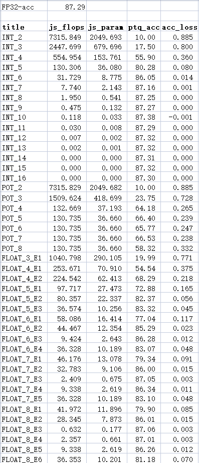

# AlexNet_BN 量化说明

+ 结构和AlexNet基本一致，在训练中的每个conv后加了bn层，量化时将conv、bn、relu合并为QConvBNReLu层。
+ 合并之后如果直接和原全精度模型的conv层进行相似度比对，不符合眼里，且拟合效果较差（可见之前commit的README）
  + 措施：将全精度模型的BN层参数fold至Conv层中，参数量和计算量也相应加至Conv层
  + 该方法不会降低全精度模型推理精度（可为全精度模型加入排除BN层的inference方法，使用fold后模型推理验证）
  + 另外测试了分别单独量化Conv和BN层的方案，精度下降较为明显。同时当前大部分量化策略都采用了Conv+BN的方案，融合能够减少运算量，使得模型更为高效。

## ptq部分

+ 量化结果：

  

+ 数据拟合

  

  