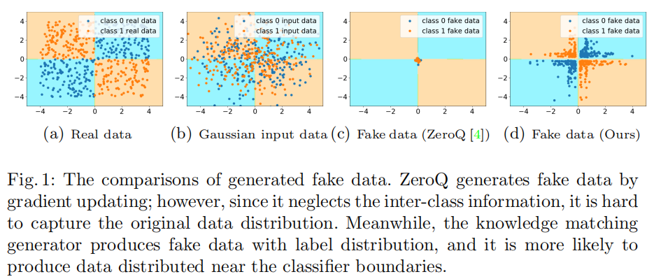

# GDFQ 说明

+ 思路源于论文 **Generative Low-bitwidth Data Free Quantization**，源代码可见https://github.com/xushoukai/GDFQ

+ 论文核心思路：

  + 从预训练模型（全精度模型）捕获信息训练生成器

    + 分类信息匹配：从预训练模型最后一层提取分类特征，给定随机标签y和高斯噪声，经过生成器网络反向得到伪数据x，将伪数据x经过全精度模型的输出z和标签y一起计算loss_one_hot.

    + 数据分布信息匹配：从预训练模型BN层提取训练数据分布信息，计算生成数据分布和真实数据分布一起计算BNS_loss

    + 生成器网络根据loss_one_hot和BNS_loss进行反向更新。得到的生成器生成的数据可以很好贴合全精度模型分类边界，且生成数据分布匹配真实数据（训练集）分布。如论文中图所示：

      

  + 伪数据驱动的低位宽量化：

    用训练得到的生成器作为输入，全精度模型提供label，对量化网络进行训练，以提高性能，即给定相同输入下，量化模型和全进度模型输出更加接近。

+ 论文代码功能取舍：

  + 由于我们的量化希望直接部署，而不经过fine-tune，也即不进行进一步的训练和调整，因此论文中的伪数据驱动可以被我们省略。
  + 论文中的生成器可以很好的模拟全精度模型的分类边界，符合我们最初对迁移安全性的定义，对经过边界附近的样本扰动下的耐受能力。因此生成器可以较好的应用于我们的框架当中

+ 实验改动：

  + 原论文直接从torchcv获取官方预训练的全精度模型，我们使用自己训练的全精度模型，这是因为安全性并不关注训练集的客观分类边界，而是关注对全精度模型的分类边界改变。

  + 生成器的效果：对之前ALL-cifar10中的所有9个模型训练了生成器。将含噪声的随机标签y经过生成器得到伪数据，将伪数据结果输入全精度模型，与y的差别作为acc标准。ResNet系列3个模型得到的生成器acc在60~70，其余模型均在99以上。说明生成器很好的拟合了分类边界，ResNet由于大量残差结构，可能分类边界较复杂，拟合效果稍差一些。

  + 运行方式：

    ```shell
    python main.py --conf_path=./cifar100_resnet20.hocon --id=01 --model_name=ResNet_18
    ```

  + 后续的安全性评估方式：

    随机生成标签，并经过生成器生成伪数据，将伪数据分别输入全精度精度模型和量化模型。以全精度模型的输出为基准，由于生成器能够很好的拟合全精度分类边界，量化模型的输出和全精度模型输出不一致的比例可以衡量量化对分类边界的改变。

+ 进一步的实验改进：

  参考论文**Qimera: Data-free Quantization with Synthetic Boundary Supporting Samples [NeurIPS 2021]**，进一步增强决策边界样本含量。