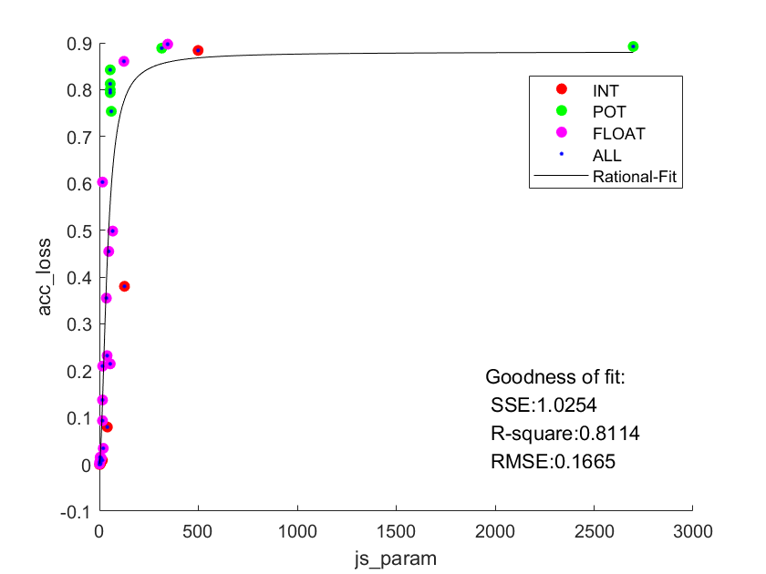

## Inception_BN 量化说明

## 新框架说明

+ 使用cfg_table进行模型快速部署和量化（可应用于其他模型），cfg_table提供整体forward平面结构，包括inc模块。inc模块则由inc_ch_table和inc_cfg_table进行部署量化。其规则可详见文件
+ cfg_table每项对应一个可进行量化融合的模块，如相邻conv bn relu可融合，在cfg_table中表现为['C','BR',...]。从而可以更方便的从该表进行量化和flops/param权重提取
+ 更改fold_ratio方法，以支持cfg_table的同项融合，多考虑了relu层，摆脱原先临近依赖的限制。方案：读取到conv时，获取相同前后缀的层，并相加
+ 更改module，允许量化层传入层的bias为none。原fold_bn已经考虑了，只需要改动freeze即可。
  + 对于Conv，freeze前后都无bias。
  + 对于ConvBN，freeze前后有bias。forward使用临时值，inference使用固定值（固定到相应conv_module）。
+ 由于允许conv.bias=None,相应改变全精度模型fold_bn方法，从而保证量化前后可比参数相同。改写方式同量化层
+ 更改js_div计算方法，一个层如果同时有多个参数，例如weight和bias，应该总共加起来权重为1。当前直接简单取平均（即js除以该层参数量），后续考虑加权。PS: Inception_BN中，外层conv层有bias，Inception模块内由于后接bn层，bias为false
  + 由于named_parameters迭代器长度不固定，需要先将排成固定列表再处理，从而获得同一层参数数，改动见ptq.py。对全精度模型做此操作即可

## ptq部分

+ 量化结果

  

+ 拟合结果
+ 

### debug

+ 观察量化结果可知，POT量化精度损失较大。尝试在Inception BN网络的不同位置反量化，观察POT量化的精度效果。即整体结构如下：量化->前半部分量化层->反量化->后半部分全精度层

+ 模型结构

  Inception_BN_cfg_table = [  
      ['C','',True,3,64,3,1,1],  
      ['R'],  
      ['C','',False,64,64,3,1,1],  
      ['R'],  
      ['Inc',0],  
      ['Inc',1],  
      ['MP',3,2,1],  
      ['Inc',2],  
      ['Inc',3],  
      ['Inc',4],  
      ['Inc',5],  
      ['Inc',6],  
      ['MP',3,2,1],  
      ['Inc',7],  
      ['Inc',8],  
      ['AAP',1],  
      ['C','',False,1024,10,1,1,0],  
      ['F']  
  ]

+ 反量化位置：

  + 最后

    | Title | ptq2  | ptq3  | ptq4  | ptq5  | ptq6  | ptq7  | ptq8  |
    | ----- | ----- | ----- | ----- | ----- | ----- | ----- | ----- |
    | acc   | 10.00 | 10.03 | 17.55 | 21.00 | 22.80 | 24.38 | 16.54 |

  + AAP层前

    | Title | ptq2  | ptq3  | ptq4  | ptq5  | ptq6  | ptq7  | ptq8  |
    | ----- | ----- | ----- | ----- | ----- | ----- | ----- | ----- |
    | acc   | 10.00 | 12.39 | 21.06 | 26.21 | 23.88 | 25.56 | 30.04 |

  + 第一个inc前

    | Title | ptq2 | ptq3  | ptq4  | ptq5  | ptq6  | ptq7  | ptq8  |
    | ----- | ---- | ----- | ----- | ----- | ----- | ----- | ----- |
    | acc   | 9.99 | 22.07 | 85.71 | 85.72 | 85.36 | 85.66 | 85.70 |

  + 第二个inc前

    | Title | ptq2  | ptq3  | ptq4  | ptq5  | ptq6  | ptq7  | ptq8  |
    | ----- | ----- | ----- | ----- | ----- | ----- | ----- | ----- |
    | acc   | 10.01 | 14.67 | 82.92 | 81.54 | 82.05 | 82.41 | 83.10 |

  + 第二个inc后

    | Title | ptq2  | ptq3  | ptq4  | ptq5  | ptq6  | ptq7  | ptq8  |
    | ----- | ----- | ----- | ----- | ----- | ----- | ----- | ----- |
    | acc   | 10.00 | 12.53 | 42.75 | 64.89 | 20.54 | 66.84 | 34.05 |

+ 根据不同反量化位置，初步推断，POT精度损失应该不是量化框架问题，而是该模型本身与量化方式不适配。