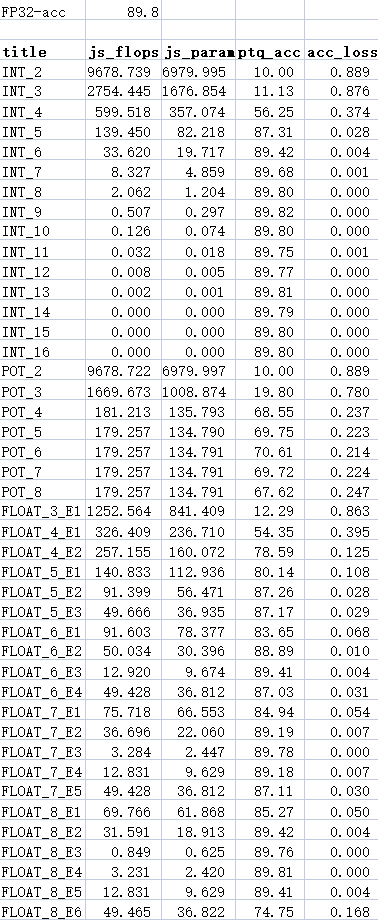
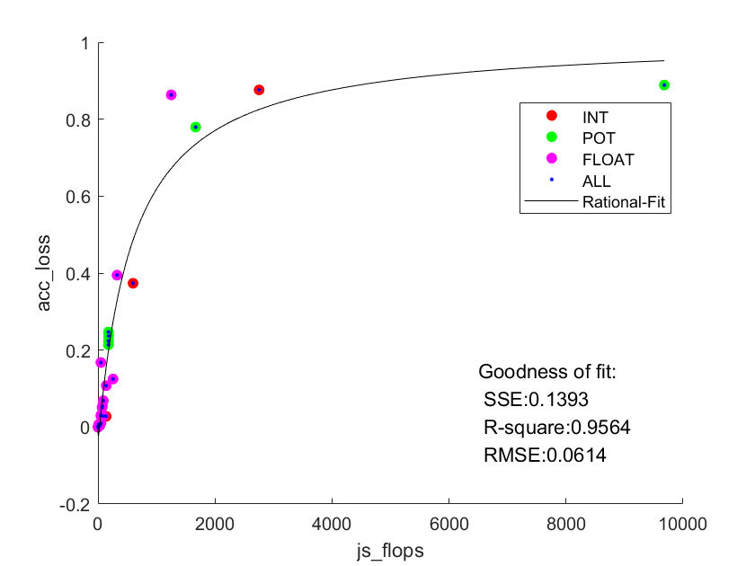
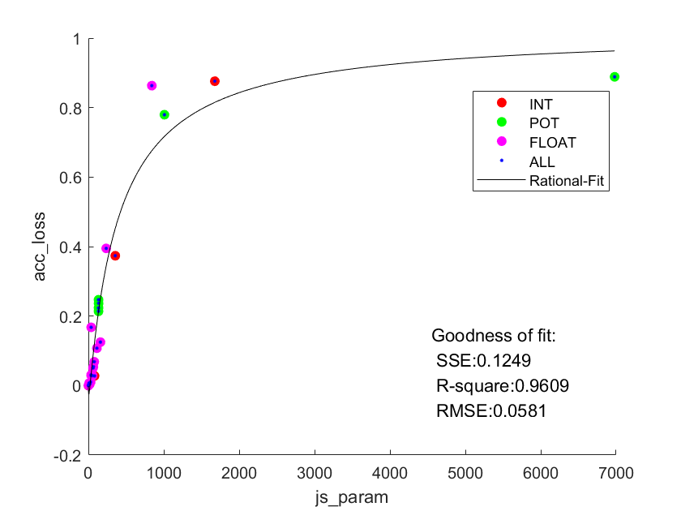

# VGG_16 量化说明

## 文件改动

+ model.py
  + 由于层数较多，为了进行快速声明，添加`make_feature/classifier_layers`，从cfg快速获得特征层和分类层
  + 根据特征层和分类层名字列表，从`quantize_feature/classifier_layers`方法快速生成对应量化层
  + 利用`quantize_utils`方法生成量化层对应的`inference/forward/freeze`方法
  + 利用上述方法可以快速进行网络迁移，从文件开头的cfg指定网络模型（非平面结构仍需进一步改进）
+ module.py
  + 由于VGG网络参数量较大，使用原先的`get_neareat_val`方法会导致显存溢出，对其进行分块处理。

## ptq部分

+ 量化结果：

  

+ 拟合结果（仍采用Rational-Fit 且分子分母多项式次数均为2）

  

  